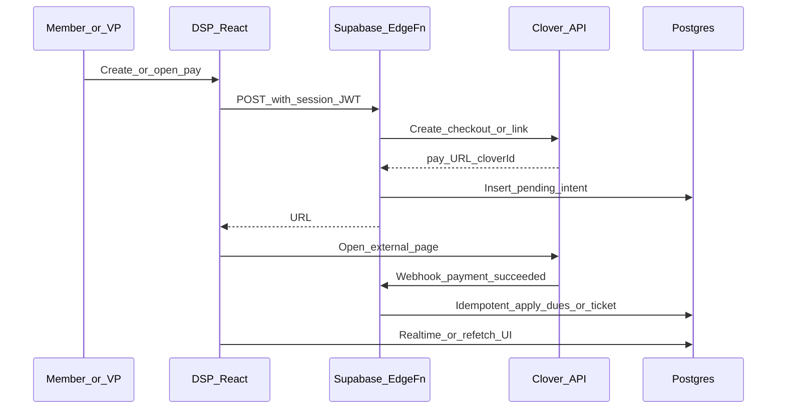

# Clover integration plan (DSP app + external setup)

## Target behavior

- Member taps **Pay** → opens **external Clover** checkout (new tab / in-app browser).
- **VP Finance** (and optionally officers) creates **payment links** from DSP; links and outcomes appear in admin views.
- When Clover confirms payment, DSP **updates dues** (via existing line-item / balance model) and/or **event tickets** (`payment_status`, existing [`payment_url`](supabase/migrations/20260409140000_brotherhood_ticketing.sql) on `ticketed_events`).
- All Clover secrets stay **server-side** (Edge Function env vars), matching how [`supabase/functions/push-webhook/index.ts`](supabase/functions/push-webhook/index.ts) already handles external triggers.

## What you do externally (checklist)

**Clover (repeat for sandbox, then production)**

1. **Clover Developer account** – Create/log in at Clover’s developer portal for your region (US vs EU APIs differ; pick the docs that match your merchant).
2. **Create a developer “app”** – You need an app for OAuth/API access and webhook subscriptions. You do **not** need a **public Marketplace listing** for a single chapter merchant; install the app only on your merchant account unless you intend to distribute to others.
3. **Configure app permissions** – Enable the minimum scopes needed for: creating payment links / invoices / ecommerce checkouts (exact names depend on Clover product you use), and reading payment/order identifiers for reconciliation.
4. **Install the app on your chapter merchant** – Complete OAuth install on the **same** Clover account you already use for dues/events (sandbox merchant first).
5. **Webhook endpoint** – After deployment, register your public URL (see below) in the Clover developer dashboard for events such as payment succeeded / payment failed / refund (exact event names per Clover’s webhook docs for your API version).
6. **Webhook verification** – Note Clover’s signing/verification method for your API version and implement it in the Edge Function (do not skip this).
7. **Decide Clover product surface** – Confirm whether you will use **Payment Links**, **Invoicing**, **Ecommerce API hosted checkout**, or another flow your merchant tier supports; that choice drives the exact REST calls and payload fields for `metadata` / note / order title used to carry DSP identifiers.

**Supabase**

8. **Secrets** – In Supabase Dashboard → Project Settings → Edge Functions secrets, add Clover-related values (e.g. client id/secret, merchant id, webhook signing secret, and any per-env base URL). Never commit these to the repo.
9. **Deploy Edge Functions** – Deploy new function(s) and note the **public HTTPS URLs** for Clover webhooks (and for internal testing with curl).
10. **Optional: custom domain** – If you use a stable branded URL for webhooks, configure it; Clover cares that the endpoint is reachable and TLS-valid.

**DSP / org process**

11. **Document who owns Clover** – One VP Finance + backup with Clover dashboard access for manual refunds and dispute handling.
12. **Runbook** – If a webhook is missed, how VP Finance triggers a **manual reconcile** or support uses Clover dashboard + a one-off “mark paid” path you may already have in [`VPFinanceDashboard`](src/features/admin/components/VPFinanceDashboard.tsx) / dues hooks.

## In-repo implementation (high level)

### 1. Data model: pending intents + idempotency

Add a small table (name illustrative) such as `payment_provider_requests` or `clover_checkouts`:

- `id` (uuid), `provider` (`clover`), `clover_checkout_id` / `payment_id` (nullable until webhook), `link_url`, `amount_cents`, `currency`, `purpose` (`dues` | `ticket` | `generic`), `user_id`, optional `ticketed_event_id` / `event_ticket_id`, `semester` for dues, `metadata` jsonb, `status` (`pending` | `completed` | `failed` | `cancelled`), `created_by`, timestamps, `idempotency_key` (unique).
- Optionally store last raw webhook payload id or hash for debugging (avoid storing full PAN data; follow Clover/PCI guidance).

Apply payments on webhook by:

- **Dues:** insert into [`dues_line_items`](supabase/migrations/20260308152641_8188a319-875c-4184-898d-632e295cbb1c.sql) (type `payment` / `credit` as your app already uses) and/or [`dues_payments`](supabase/migrations/20251213191430_c1727253-1ef3-4de5-9896-a041d593436d.sql) — align with how [`useRecordDues`](src/features/dues/hooks/useDues.ts) and [`computeMemberBalance`](src/features/dues/hooks/useDuesConfig.ts) expect data so the member’s status becomes `paid` when balance ≤ 0.
- **Tickets:** update [`event_tickets`](supabase/migrations/20260409140000_brotherhood_ticketing.sql) `payment_status` to `paid` and tie to the correct row (prefer `event_ticket_id` in metadata when the ticket was claimed before payment).

Use a **single DB transaction** in the webhook handler: insert external payment row if absent, then apply domain updates, keyed by Clover payment id.

**RLS:** intents likely **no direct client SELECT** (service role in Edge Function only), or narrow officer read via policy if VP Finance needs a list view.

### 2. Edge Functions

- **`clover-webhook`** (public `POST`, no user JWT): verify Clover signature, parse event, load pending intent by external id / metadata, **idempotent** apply to dues/ticket tables, update intent status.
- **`clover-create-checkout`** (authenticated): verify Supabase JWT and role (VP Finance / `is_admin_or_officer` parity with existing admin patterns), validate amount and target user/event, call Clover API to create link/session, insert pending row, return `{ url }` to the client.

Follow the same Deno style and env access as [`push-webhook`](supabase/functions/push-webhook/index.ts).

### 3. Frontend

- **Member dues / ticket screens:** “Pay with Clover” calls `clover-create-checkout` (or reads a pre-created link), then `window.open(url)` / `Linking.openURL` on mobile.
- **[`VPFinanceDashboard`](src/features/admin/components/VPFinanceDashboard.tsx):** section to create generic or per-member dues links, show table of pending/completed intents (reading via RPC or officer-only view as you design RLS).
- **Ticketing UI:** where `payment_url` is shown today, prefer API-generated links that include `event_ticket_id` in metadata when possible.

### 4. Types and exports

- Regenerate or extend [`src/integrations/supabase/types.ts`](src/integrations/supabase/types.ts) after migrations.
- Add any VP Finance export rows to [`exportRegistry`](src/features/admin/lib/exportRegistry.ts) if you want CSV of Clover-backed payments.

## Phased delivery (recommended)

1. **Phase A – Webhook + DB only:** table + `clover-webhook` + manual test from Clover sandbox (simulate or real small payment); verify dues line item appears.
2. **Phase B – Create link API + VP Finance UI:** authenticated Edge Function + dashboard section.
3. **Phase C – Tickets:** wire metadata and ticket row updates; align with `claim_ticketed_event_ticket` flow if users must claim before paying.
4. **Phase D – Hardening:** retries, admin “reconcile” query, logging/monitoring, production Clover switch and webhook URL update.

## Risks and decisions to confirm early

- **Clover API region and product** (link vs invoice vs ecommerce) — drives exact endpoints and which metadata fields survive to the webhook.
- **Identity:** always create checkouts **from authenticated DSP users** so `user_id` is server-trusted; avoid “anyone with the link pays and attributes to wrong member” unless amounts are generic and attribution is manual.
- **Refunds/chargebacks:** define whether DSP auto-reverses line items or flags manual review.
